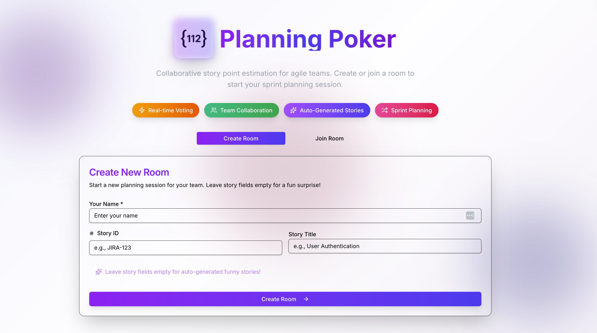
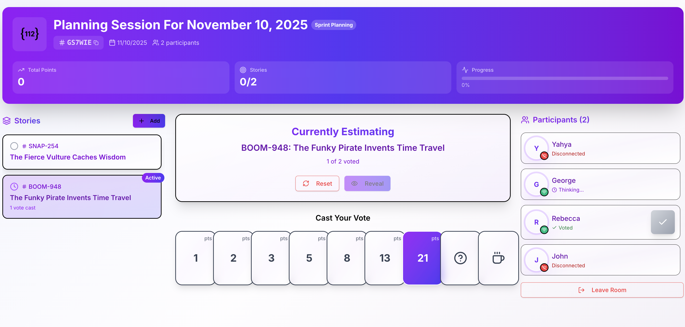
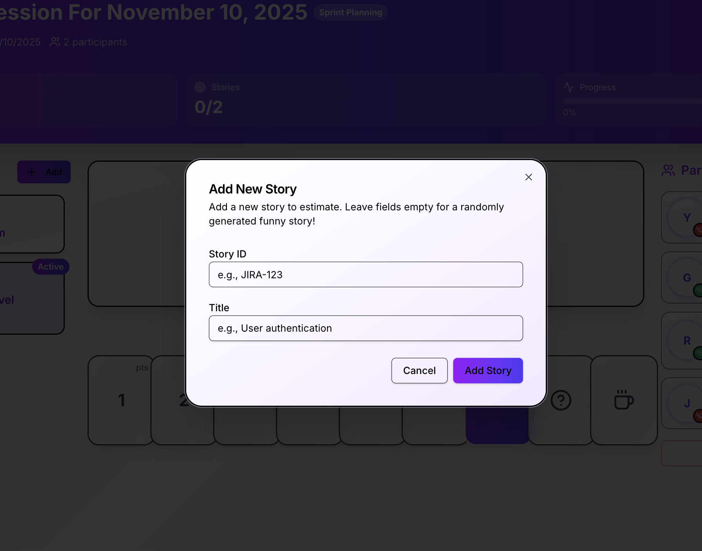
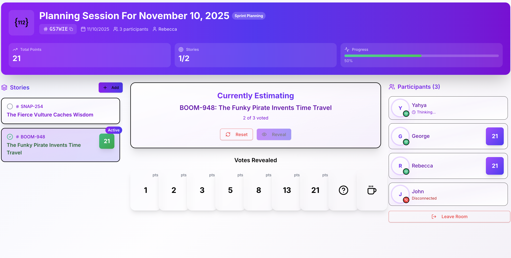
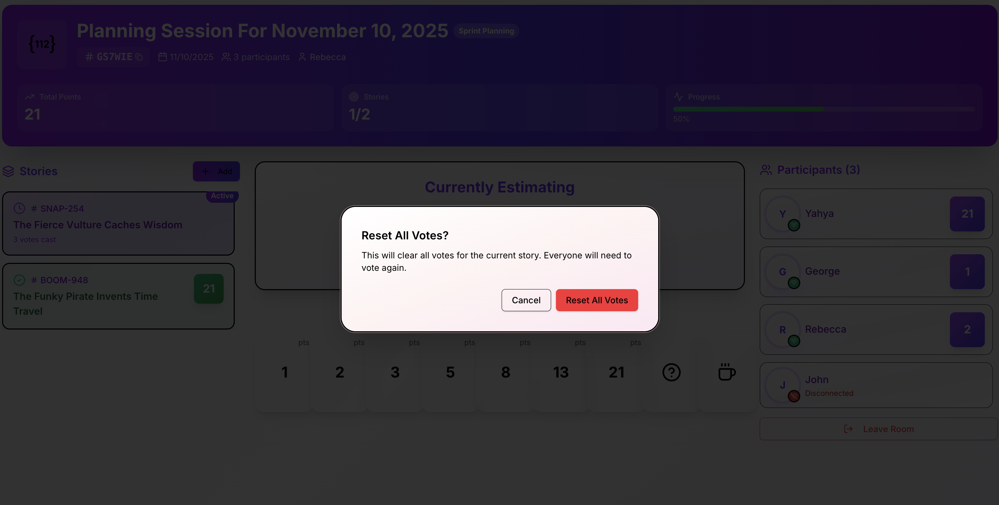

# Planning Poker Application

A real-time collaborative story point estimation tool for agile development teams, built with Django + React.

## Features

- **Real-time Collaboration**: WebSocket-powered live updates across all participants
- **Story Point Estimation**: Fibonacci sequence voting with average calculation
- **Story Management**: Create, switch between, and track multiple user stories
- **Vote Revelation**: Democratic reveal when all participants have voted
- **Reset & Confirmation**: Reset votes with confirmation dialogs to prevent accidents
- **Funny Story Generator**: Auto-generate creative story titles when fields are left empty
- **Responsive Design**: Works seamlessly on desktop, tablet, and mobile devices
- **Automation Ready**: Complete data-testid attributes for automated testing

## Technology Stack

- **Backend**: Django 5.0.1 + Django Channels 4.0.0 (WebSockets)
- **Frontend**: React 19.2.0 + TypeScript + Vite 7.2.2
- **UI**: Tailwind CSS + shadcn/ui components
- **Database**: SQLite (development)
- **Real-time**: WebSocket connections with Redis channel layer

## Quick Start

### Prerequisites
- Python 3.11+
- Node.js 18+
- Redis Server

### Installation

1. **Clone the repository**
   ```bash
   git clone <repository-url>
   cd planning-poker
   ```

2. **Backend Setup**
   ```bash
   cd backend
   python -m venv venv
   source venv/bin/activate  # On Windows: venv\Scripts\activate
   pip install -r requirements.txt
   python manage.py migrate
   python manage.py runserver
   ```

3. **Frontend Setup**
   ```bash
   cd frontend
   npm install
   npm run dev
   ```

4. **Access the Application**
   - Frontend: `http://localhost:5173`
   - Backend API: `http://localhost:8000`

## Application Walkthrough

### 1. Home Page - Creating & Joining Rooms



**Key Features:**
- **Create Room**: Start a new estimation session
- **Story Fields**: Optional ID and title (auto-generates funny stories if empty)
- **Join Room**: Enter existing 6-character room code
- **Validation**: Ensures username is provided

### 2. Main Room Interface



**UI Components:**

#### **Stories Sidebar (Left)**
- **Green**: Estimated stories with final points
- **Blue Ring**: Currently active story
- **Gray**: Unestimated stories
- **Running Total**: Sum of all estimated story points

#### **Current Story (Center)**
- **Story Info**: ID, title, and description
- **Voting Status**: Shows vote count (e.g., "3/4 voted")
- **Vote Progress**: Visual indicator when everyone has voted

#### **Participants List (Right)**
- **Real-time Status**: Shows who has voted
- **Vote Values**: Displays actual votes when revealed
- **Connection Status**: Active/disconnected participants

#### **Voting Cards (Bottom)**
- **Fibonacci Sequence**: 1, 2, 3, 5, 8, 13, 21
- **Special Cards**: ? (uncertain), ☕ (break needed)
- **Visual Feedback**: Selected card highlighted in blue

### 3. Voting Flow & States

#### **State 1: Initial Voting**
```
Cast Your Vote
[1] [2] [3] [5] [8] [13] [21] [?] [☕]

Participants (4):
John         Waiting
Mary         Waiting  
Bob          Waiting
Alice        Waiting
```

#### **State 2: Partial Voting**
```
Cast Your Vote
[1] [2] [3] [5] [8] [13] [21] [?] [coffee]
            ↑ Your vote

Participants (4):              Vote Status: 3/4 voted
John         [checkmark] Hidden
Mary         [checkmark] Hidden  
Bob          Waiting
Alice        [checkmark] Hidden
```

#### **State 3: Everyone Voted**
```
Cast Your Vote (Disabled)
[1] [2] [3] [5] [8] [13] [21] [?] [☕]

Participants (4):              Everyone has voted!
John         [checkmark] Hidden     [Reveal] button enabled
Mary         [checkmark] Hidden  
Bob          [checkmark] Hidden
Alice        [checkmark] Hidden
```

#### **State 4: Votes Revealed**
```
Cast Your Vote (Disabled)
[1] [2] [3] [5] [8] [13] [21] [?] [coffee]
```


### 4. Story Management

#### **Adding New Stories**



**Auto-Generated Examples:**
- `EPIC-542: The Mystical Unicorn Debugs Life`
- `LOL-789: The Dancing Penguin Scales Mountains`
- `WOW-123: The Caffeinated Sloth Implements Magic`

#### **Story Switching**
- Click any story in the sidebar to switch
- Votes are preserved when switching between stories
- Current story indicator follows your selection

#### **Story States Visual Guide**



**Story State Indicators:**
- **Green**: Estimated (Green)
- **Blue Ring**: Currently active story
- **Gray**: Unestimated stories
- **Running Total**: Sum of all estimated story points

### 5. Reset & Confirmation Flow

#### **Reset Confirmation Dialog**



**Reset Behavior:**
- Clears all participant votes
- Removes final story points (if estimated)
- Changes story from green back to gray
- Allows re-voting on the story

### 6. Responsive Design

#### **Desktop View (1200px+)**
- Three-column layout: Stories | Main | Participants
- Large voting cards in grid layout
- Full text labels and descriptions

#### **Tablet View (768px - 1199px)**
- Stacked layout: Main content above sidebars
- Medium voting cards
- Abbreviated text where needed

#### **Mobile View (<768px)**
- Single column, stacked components
- Compact voting cards in grid
- Touch-optimized buttons and interactions

## User Scenarios

### **Scenario 1: Team Estimation Session**

1. **Scrum Master** creates room with first story
2. **Team members** join using the room code
3. **Discussion** about story complexity
4. **Everyone votes** using voting cards
5. **Reveal** shows average (e.g., 7.25 → 8 points)
6. **Team discusses** if they agree with 8 points
7. **Confirm** to finalize, or **Re-vote** if needed
8. **Add next story** and repeat the process

### **Scenario 2: Multi-Story Sprint Planning**

```
Session Progress:
Login System (8 pts)      - Completed
User Dashboard (13 pts)   - Completed  
Payment Flow             - Currently voting
Admin Panel              - Pending
Reports Module           - Pending

Total Estimated: 21 points
```

### **Scenario 3: Handling Disagreements**

```
Revealed Votes: [1, 1, 2, 13, 21]
Average: 7.6 → 8 points

Team Discussion:
- Low votes (1,1,2): "This looks simple"
- High votes (13,21): "There are hidden complexities"

Decision: Reset and re-vote after discussion
```

## Technical Features

### **Real-time WebSocket Updates**
- Vote casting appears instantly for all users
- Story switching synchronized across browsers  
- Connection status monitoring
- Automatic reconnection handling

### **Data Persistence**
- All votes saved to database
- Story estimates preserved between sessions
- Room state maintained across disconnections
- Historical estimation data retained

### **Security & Validation**
- Input validation on all forms
- SQL injection prevention
- XSS protection with proper sanitization
- CORS configuration for API access

### **Automation Support**
Complete `data-testid` attributes for testing:
```html
<button data-testid="reveal-button">Reveal</button>
<div data-testid="voting-card-5">5</div>
<span data-testid="participant-vote-user123">8</span>
```

## API Reference

### **REST Endpoints**

```bash
# Create room
POST /api/rooms/
{
  "story_id": "JIRA-123",  # optional
  "title": "User Login"    # optional
}

# Join room  
POST /api/rooms/{code}/join/
{
  "username": "John",
  "session_id": "john-12345"
}

# Add story
POST /api/rooms/{code}/add_story/
{
  "story_id": "TASK-456",  # optional
  "title": "New Feature"   # optional
}

# Reset room
POST /api/rooms/{code}/reset/

# Reveal votes
POST /api/rooms/{code}/reveal/
```

### **WebSocket Events**

```javascript
// Voting
ws.send(JSON.stringify({
  type: 'vote',
  participant_id: 'user-123',
  story_id: 'story-456', 
  value: '8'
}));

// Story switching
ws.send(JSON.stringify({
  type: 'change_story',
  story_id: 'story-789'
}));

// Reset votes
ws.send(JSON.stringify({
  type: 'reset'
}));
```

## Design System

### **Color Scheme**
- **Primary**: Blue (#3b82f6) - Current story indicators
- **Success**: Green (#22c55e) - Estimated stories
- **Muted**: Gray (#6b7280) - Unestimated stories
- **Destructive**: Red (#ef4444) - Reset confirmations
- **Warning**: Orange (#f97316) - Existing story dialogs

### **Typography**
- **Headers**: Inter font, bold weights
- **Body**: Inter font, regular weights  
- **Code**: Mono font for room codes and story IDs

### **Component States**
- **Hover**: Subtle scale and shadow effects
- **Active**: Color changes and ring borders
- **Disabled**: Opacity reduction and cursor changes
- **Loading**: Skeleton states and spinners

## Deployment

### **Recommended Subdomain**
- **Suggested**: `poker.software-development.it`
- **Alternative**: `planning.software-development.it`

### **Production Environment**
- **Database**: PostgreSQL recommended
- **Cache**: Redis for WebSocket channels
- **Static Files**: CDN for assets
- **SSL**: HTTPS required for WebSocket security

### **Environment Variables**
```bash
DEBUG=False
ALLOWED_HOSTS=poker.software-development.it
DATABASE_URL=postgresql://...
REDIS_URL=redis://...
SECRET_KEY=your-secret-key
```

## Contributing

1. **Fork** the repository
2. **Create** a feature branch
3. **Add** comprehensive tests
4. **Follow** code style guidelines
5. **Submit** pull request with clear description

## License

This project is licensed under the MIT License - see the [LICENSE](LICENSE) file for details.

## Acknowledgments

- **shadcn/ui** for beautiful React components
- **Django Channels** for WebSocket support
- **Tailwind CSS** for utility-first styling
- **Lucide React** for consistent icons

---

**Built with love for agile development teams**